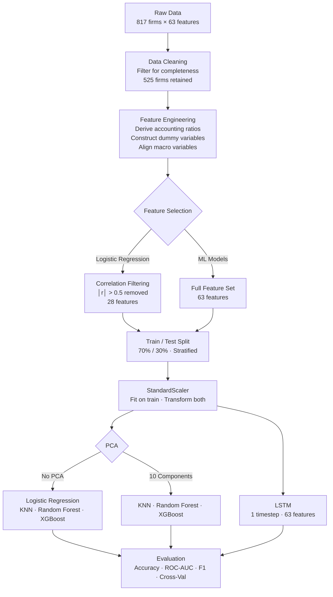

# 🏦 Bankruptcy Prediction for Indian Firms

> **Predicting corporate financial distress using ensemble machine learning and deep learning — tailored for India's unique regulatory and economic landscape.**

[](https://python.org)
[](https://scikit-learn.org)
[](https://tensorflow.org)
[](LICENSE)

---

## Overview

Corporate bankruptcy carries serious consequences for shareholders, creditors, employees, and the broader economy. In India, the introduction of the **Insolvency and Bankruptcy Code (IBC)** in 2016 created a structured resolution mechanism — yet the ability to *predict* distress before it occurs remains critical for proactive risk management.

This project develops and compares multiple bankruptcy prediction models — from classical logistic regression to ensemble tree methods and LSTM deep learning — specifically calibrated for Indian listed companies. The study covers **525 firms** (75 bankrupt, 450 non-bankrupt) across the period **2002–2022**, using a rich set of 63 features drawn from four distinct domains.

**Academic context:** MBA in Business Economics (Analytics & Finance), Department of Finance and Business Economics, Delhi University. Supervised by Dr. Sonal Thukral.

---

## Business Problem

> *"Can we identify, from a company's financial statements and macroeconomic context, whether it will file for bankruptcy within the next one to three years?"*

Early detection of financial distress allows:

- **Investors** to exit or restructure positions before losses crystallise
- **Creditors** to renegotiate terms or accelerate debt recovery
- **Regulators** to intervene early and protect systemic stability
- **Management** to take corrective action while options remain open

---

## Research Objectives

1. Identify the critical financial and macroeconomic determinants of corporate bankruptcy in India
2. Develop robust prediction models using statistical and ML approaches tailored to the Indian context
3. Evaluate and compare model performance across multiple metrics

---

## Dataset

| Property | Value |
|---|---|
| **Total firms** | 525 (75 bankrupt, 450 non-bankrupt) |
| **Original sample** | 817 firms (filtered for data completeness) |
| **Time period** | 2002–2022 |
| **Observation window** | 3 years prior to last published financial report |
| **Total features** | 63 |

### Data Sources

| Source | Data Type |
|---|---|
| **IBBI** (Insolvency & Bankruptcy Board of India) | Bankrupt firm list |
| **NSE Nifty 500** | Non-bankrupt firm list |
| **ProwessIQ by CMIE** | Financial statements, market data |
| **Macrotrends.com** | Macroeconomic indicators |

### Feature Categories

The 63 predictive features span four domains:

```
Profitability    (8)   — ROA variants, Gross Profit Margin, EBITA/Capital Employed
Liquidity        (7)   — Current Ratio, Quick Ratio, DSCR, Cash/Current Liability
Solvency         (3)   — Debt/Equity, Total Debt/Net Worth, Contingent Liability
Efficiency       (7)   — Fixed Asset Turnover, AR Turnover, Working Capital Ratios
Cash Flow        (7)   — CFO to Assets, Cash Flow to Revenue, Cash Flow to Equity
Risk Management  (12)  — EPS, ROE, Market Return, Volatility, Leverage Flags
Financial Flags  (5)   — Net Income Flag, Liability-Assets Flag, DFL, Tax Rate
Macroeconomic    (6)   — GDP Growth, Inflation, Unemployment, FDI/GDP, Market Return
```

---

## Methodology

### Workflow



### Models

| Model | Feature Set | Purpose |
|---|---|---|
| **Logistic Regression** | 28 filtered features | Interpretable statistical baseline |
| **K-Nearest Neighbours** | 63 / 10 PCA | Instance-based classifier |
| **Random Forest** | 63 / 10 PCA | Ensemble (bagging) — robust, handles non-linearity |
| **XGBoost** | 63 / 10 PCA | Ensemble (boosting) — state-of-the-art tabular performance |
| **LSTM** | 63 features | Captures temporal dependencies in sequential financial data |

### Preprocessing

1. **Multicollinearity removal** — features with mutual |r| > 0.5 dropped, keeping the one more correlated with the target (63 → 28 features for LR baseline)
2. **Train/test split** — 70/30 stratified split; `random_state=42` for reproducibility
3. **Standard scaling** — `StandardScaler` fitted on training data only (no data leakage)
4. **PCA** — 10 principal components applied to the full 63-feature set for ablation study

---

## Results

### Model Performance Summary

| Model | Accuracy | ROC-AUC | F1-Score | Cross-Val |
|---|---|---|---|---|
| **XGBoost** | **98.10%** | 0.9784 | **0.93** | 0.9375 |
| **Random Forest** | 97.47% | **0.9939** | 0.91 | **0.9568** |
| XGBoost [PCA] | 98.10% | 0.9826 | 0.83 | 0.8655 |
| Random Forest [PCA] | 97.47% | 0.9847 | 0.81 | 0.8751 |
| **LSTM** | 96.20% | 0.9800 | 0.88 | — |
| KNN [PCA] | 96.84% | 0.9957 | 0.89 | 0.8879 |
| KNN | 93.67% | 0.9395 | 0.76 | 0.8414 |
| Logistic Regression | 91.77% | — | — | — |

### Key Findings

- **Ensemble methods dominate** — Random Forest and XGBoost achieve the highest accuracy and AUC scores, consistent with the broader ML literature on bankruptcy prediction (Barboza et al., 2017)
- **PCA tradeoff** — Dimensionality reduction improved KNN but slightly reduced ensemble performance, suggesting that Random Forest and XGBoost extract value from the full feature space
- **LSTM shows promise** — At 96.2% accuracy and 0.98 AUC, the LSTM is competitive despite treating each firm as a single time step; true time-series formulation could push this further
- **Logistic baseline exceeds prior India-specific work** — 91.77% vs Bapat & Nagale (2014) at 75%, likely due to the richer feature set and longer data span
- **Significant logistic predictors** — FDI as % of GDP (p < 0.001) and Employee Utilisation Ratio (p < 0.05) are statistically significant

---

## Repository Structure

```
bankruptcy-prediction-india/
│
├── README.md                        ← This file
├── requirements.txt                 ← pip dependencies
├── environment.yml                  ← conda environment
├── LICENSE                          ← MIT
├── .gitignore
│
├── data/
│   ├── raw/                         ← Source Excel file (not committed)
│   └── processed/                   ← Serialised train/test splits (not committed)
│
├── notebooks/
│   ├── 01_eda_and_preprocessing.ipynb    ← EDA, correlation analysis, splitting
│   └── 02_model_training_and_evaluation.ipynb  ← All models + results
│
├── src/
│   ├── data_preprocessing.py        ← Loading, feature selection, scaling
│   ├── feature_engineering.py       ← PCA and variance analysis
│   ├── train.py                     ← Model training functions
│   ├── evaluate.py                  ← Metrics and visualisation
│   └── utils.py                     ← Shared helpers
│
├── models/                          ← Serialised trained models (gitignored)
│
├── results/
│   ├── model_comparison.csv         ← Aggregated metrics table
│   └── figures/                     ← All generated plots
│
└── docs/
    └── research_paper.pdf           ← Full academic paper
```

---

## Technologies

| Category | Tool |
|---|---|
| Language | Python 3.10 |
| ML framework | scikit-learn 1.3 |
| Deep learning | TensorFlow / Keras 2.13 |
| Data | pandas, numpy, openpyxl |
| Visualisation | matplotlib, seaborn, plotly |
| Statistical modelling | statsmodels |
| Notebooks | Jupyter |

---

## Getting Started

### 1. Clone the Repository

```bash
git clone https://github.com/YOUR_USERNAME/bankruptcy-prediction-india.git
cd bankruptcy-prediction-india
```

### 2. Set Up the Environment

**Option A — pip:**
```bash
python -m venv venv
source venv/bin/activate          # Windows: venv\Scripts\activate
pip install -r requirements.txt
```

**Option B — conda:**
```bash
conda env create -f environment.yml
conda activate bankruptcy-prediction
```

### 3. Add the Dataset

Place the raw Excel file at:
```
data/raw/financial_data.xlsx
```

> The dataset contains proprietary ProwessIQ data and is not included in this repository. Contact the author for access or replicate using CMIE ProwessIQ with the firm list from IBBI.

### 4. Run the Notebooks

```bash
jupyter notebook notebooks/
```

Run the notebooks in order:
1. `01_eda_and_preprocessing.ipynb` — EDA and generate processed splits
2. `02_model_training_and_evaluation.ipynb` — Train all models and evaluate

### 5. Run as Scripts (Optional)

```python
# Example: run the full pipeline programmatically
from src.data_preprocessing import load_dataset, preprocess
from src.train import get_classical_models, train_and_evaluate_classical

df = load_dataset("data/raw/financial_data.xlsx")
X_train, X_test, y_train, y_test, scaler, features = preprocess(df, apply_feature_selection=False)

models = get_classical_models()
results = train_and_evaluate_classical(models, X_train, X_test, y_train, y_test)
print(results)
```

---

## Limitations & Future Work

**Current limitations:**

- Dataset restricted to publicly listed firms on NSE — private companies and SMEs are excluded
- LSTM trained on cross-sectional data; a genuine panel time-series formulation requires longer per-firm histories
- Class imbalance (14% bankrupt) is not explicitly addressed with resampling techniques
- Qualitative factors (management quality, governance, board composition) are absent

**Promising future directions:**

- **Semi-supervised learning** to leverage unlabelled private firm data
- **Transfer learning** from US/global bankruptcy datasets to supplement limited Indian data
- **NLP integration** — sentiment from annual report MD&A sections as additional features
- **Survival analysis** — Cox proportional hazards model for time-to-bankruptcy estimation
- **Explainability** — SHAP values to make Random Forest / XGBoost predictions interpretable

---

## Academic Reference

If you use this code or dataset in your research, please cite:

```bibtex
@article{solanki2024bankruptcy,
  title   = {Bankruptcy Prediction: A Case of Indian Firms},
  author  = {Solanki, Aayush and Thukral, Sonal},
  journal = {Department of Finance and Business Economics, Delhi University},
  year    = {2024}
}
```

---

## Acknowledgements

- **Dr. Sonal Thukral** — guidance and supervision throughout this research
- **IBBI** (Insolvency and Bankruptcy Board of India) — bankrupt firm list
- **CMIE ProwessIQ** — financial and market data
- **NSE** — Nifty 500 non-bankrupt firm universe
- The authors of the foundational works cited in the paper, especially Altman (1968), Barboza et al. (2017), and Narvekar & Guha (2021)

---

## Contact

**Aayush Solanki**  
MBA — Business Economics (Analytics & Finance)  
Delhi University  
📧 aayushsolanki.work@gmail.com  
🔗 [LinkedIn](https://www.linkedin.com/in/aayush-solanki-mbe) | [GitHub](https://github.com/solanki-aayush)

---

*This project was completed as part of an MBA thesis. Results and conclusions are documented in the full research paper available in `docs/research_paper.pdf`.*
